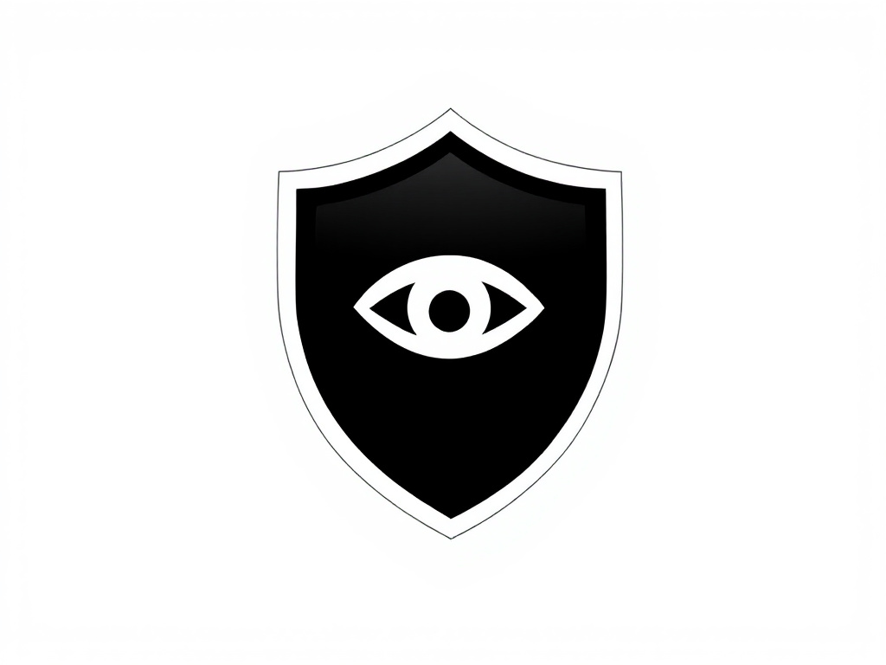

# 🛡️ H-CopySentry Extension


**H-CopySentry** is a Chrome Extension crafted to help maintain **exam integrity** by silently altering copied text on exam portals. It replaces clipboard contents with encrypted text, ensuring users can't misuse or share exam content — all without alerting them.

> 🔒 Developed for institutions that need to secure online exams and discourage content leakage.

---

## 🎯 Project Goals

- Maintain **academic honesty** in online exams
- Disable meaningful copy-paste of questions/content
- Do so **silently** — user believes they copied text
- Provide a lightweight browser-based solution

---

## 📦 Features

- 🕵️‍♂️ Monitors copy actions on all web pages
- 🔐 Encrypts selected text using AES-GCM
- 🧹 Deletes clipboard data silently if selection is too large
- 🧠 User remains unaware of alteration
- ⚡ Runs purely on client-side — no server required
- 🧩 Can be integrated into exam portal environments

---

<!--
## 🖼️ Screenshots

> 📸 Add these after UI or admin interface is built.

| Extension Icon | Copy Behavior | Developer Tools Log |
|----------------|---------------|----------------------|
|  |  |  |

--- -->
<!--
## 📽️ Demo

> 📹 Full walkthrough video will be added soon.

For now, here's what it looks like in action:


--- -->

## 🛠️ Installation (Development Mode)

1. Clone or download this repo:
   ```bash
   git clone https://github.com/hasnainsheikh15/H-CopySentry.git
   ```
